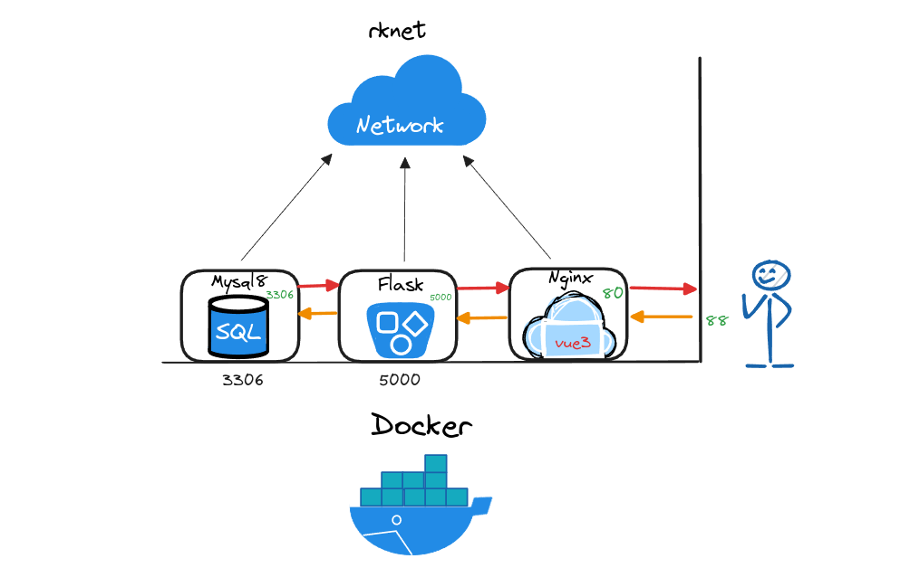
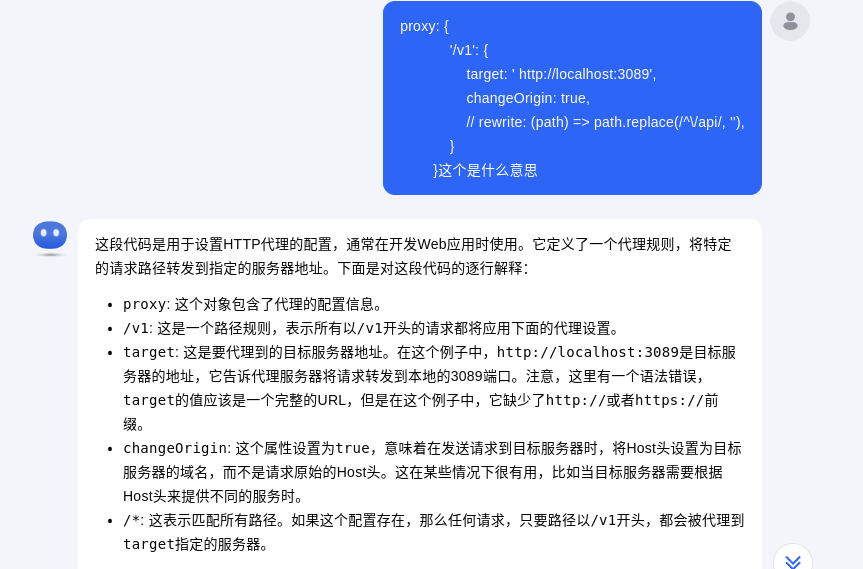
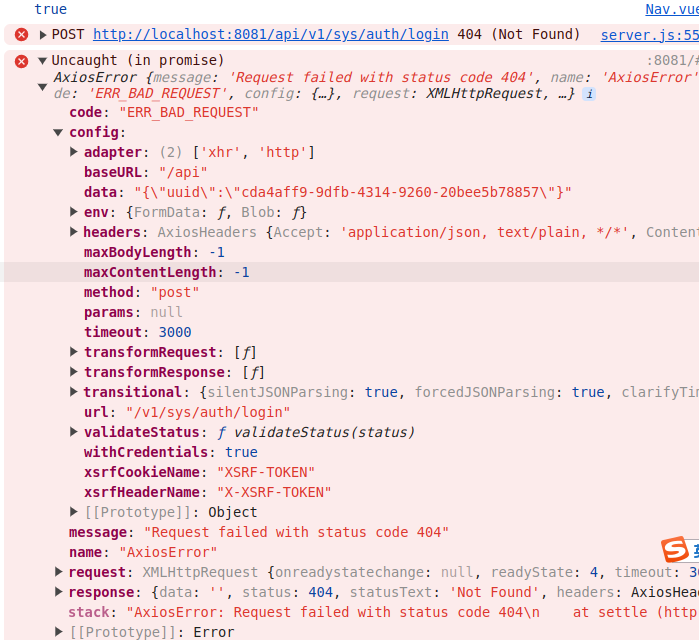
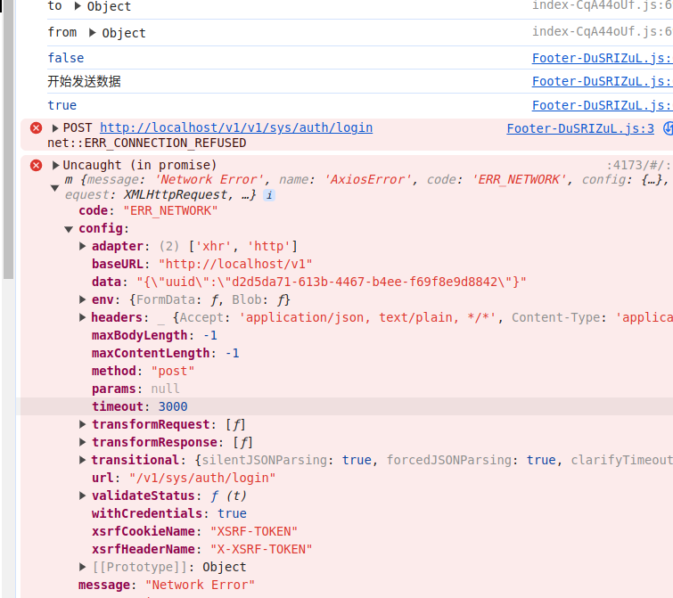
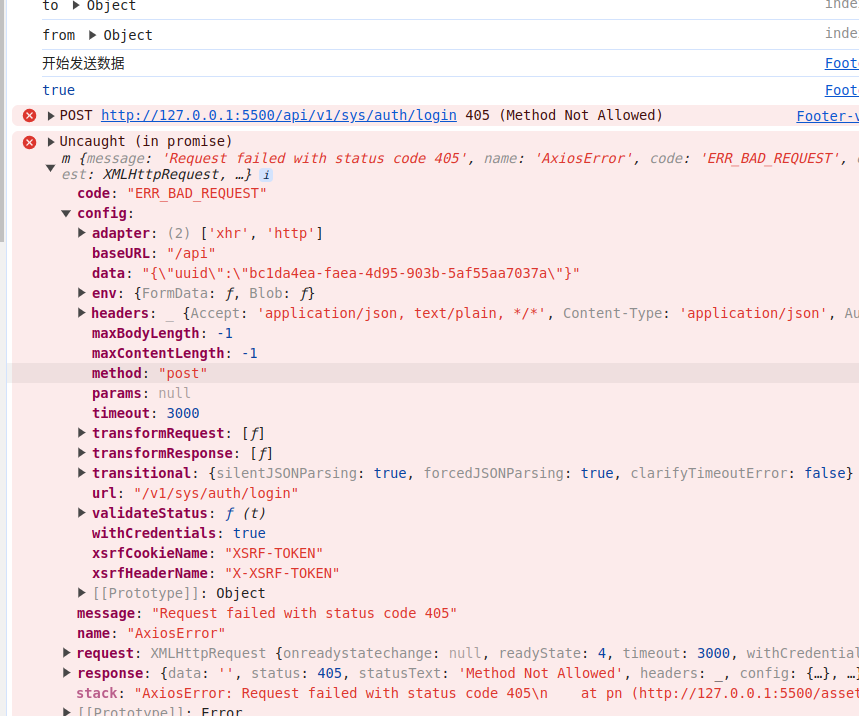
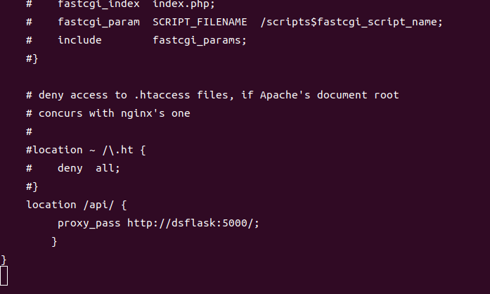

## 对于docker服务的实践应用
docker 技术的一系列使用

## 项目描述

本项目使用docker-compose实现 mysql8.0 + flask + nginx(挂载打包的vue3应用)  数据集工作站项目  服务部署

服务如下图：

## 实现原理：

1 mysql8.0 + flask compose启动:

>1.1 使用dockerfile 对本地开发的flask后端服务进行打包
-   将开发好的flask单独dockerfile打包,无法数据库通信，可以访问公开地址；

>1.2 使用docker-compose  实现两个应用在同一自定义网络，且相关目录挂载，及卷持久化存储
-   docker-comopse 启动mysql和flask两个服务(桥连至同一自定义网络，目录挂载，卷映射, 配置环境变量以及数据库创建初始化等), 数据库没有表存在,通信失败；
-   优化docker-comopse(flask卷映射)  + 本地flask服务对容器内的数据库进行初始化
-   将初始化完成的数据库映射在本地的卷地址 打包至 mysql中形成新的myslq镜像

-   Finish

2 nginx作为代理服务器挂载vite打包的Vue3前端应用

> 2.1 使用vite对Vue3应用进行打包，将打包后的disk目录使用dockerfile 打包到nginx镜像v1.0中 
-   vite打包后报错：无用的变量
-   vite打包后报错：空白页，Vue-router 路由模式：history ---> hash
    
> 2.2 使用docker-compose 将 mysql8.0 + flask + nginx up -d ， 配置nginx代理服务器，使前后端通信正常后，将配置文件打包进nginxv2.0中
-   vue应用代理服务器配置错误： 
    -   使用 .env.development 和 .env.production作为 前端路由地址              参考：nginx/rkweb_dataset/
    -   vite.config.ts 文件中的代理配置错误                                    参考：nginx/rkweb_dataset/vite.config.ts
    -   axios 创建错误                                                       参考：nginx/rkweb_dataset/src/api/server.js
-   nginx服务配置
    -   修改nginx容器在本地卷中的配置文件：配置代理设置                            参考：nginx/rkweb_dataset/src/default.conf

-   Finish

3 参考信息：

(参考1)[https://blog.csdn.net/ClearloveYt/article/details/134462707]

(参考2)[https://blog.csdn.net/sunrj_niu/article/details/112181688]

(参考3)[https://github.com/ZHYI-source/ZHOUYI-Homepage.git]

1 Vue3代理配置解释

2 npm run dev 接口信息

3 npm run preview 接口信息

4 打包后  接口信息

5 nginx 代理服务器配置 

## Qucik start 

docker compose up -d

## 已知bug

数据集文件下载后没有内容：undo

## Q&A

> 1、如何测试flask + mysql8.0的compose启动服务正常？

 前端应用通过 docker映射在外部的端口 测试flask提供的服务;

> 2、这个项目适合谁？

 适合有基础的 Vue开发 + flask开发 + docker服务部署 的开发人员或有意向从事该方向的毅力坚定的学习者；

> 3、有相关的学习资源吗？

 你小子、（不谢）

1、[Python flask相关视频](https://space.bilibili.com/162101364?spm_id_from=333.337.0.0)

2、[Python fastapi视频](https://space.bilibili.com/393081225)

3、[前端 vue相关视频](https://space.bilibili.com/1346756964?spm_id_from=333.788.0.0)

4、[前端 vue相关视频](https://space.bilibili.com/510086367/?spm_id_from=333.999.0.0)

5、[前端 vue相关代码](https://gitee.com/Z568_568/)

6、[docker 视频教程](https://www.bilibili.com/video/BV1Zn4y1X7AZ)

### summary

    1 代码学习最有效的方式是模仿，然后再实践，将代码都积累起来，在实践中渐渐地就能感受到量变到质变

    2 我觉得我还是有情怀的，帮助别人的情怀，上面的六条链接，对于学习者而言：2000rmb 我觉得是值的

    3 修行靠个人，加油啦（2024.8.8 16：00）